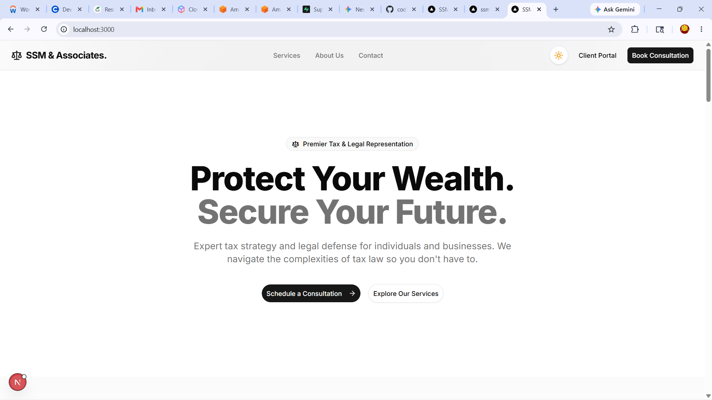
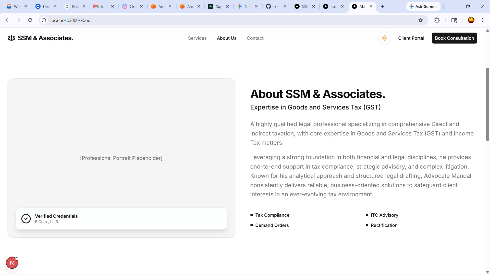
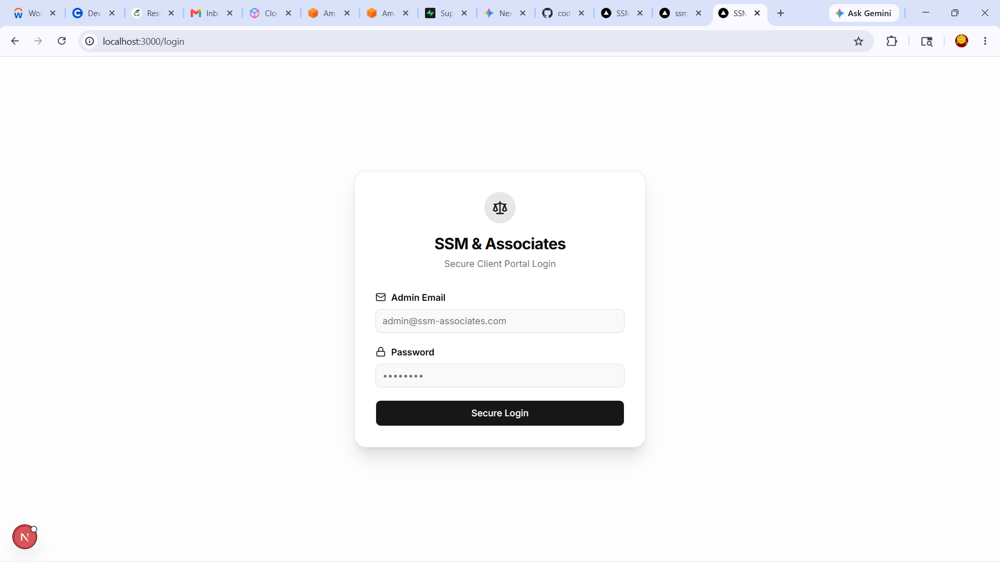
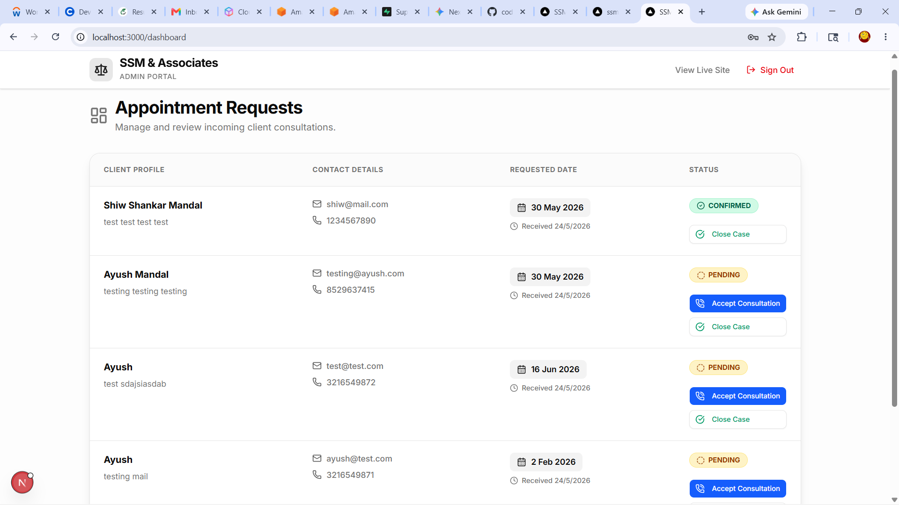

# SSM & Associates - Legal & Tax Consultancy Platform



A premium, full-stack web application engineered for **SSM & Associates**, a prestigious legal and tax consultancy firm. This platform serves as both a client-facing marketing portal and a highly secure, internal administration dashboard for managing case inquiries and client appointments.

## 🚀 Key Features

### Public-Facing Portal
* **Premium UI/UX:** Built with Tailwind CSS, featuring subtle animations, glassmorphism, and a meticulously crafted dark/light mode toggle.
* **Dynamic Routing:** Utilizes Next.js App Router for seamless, lightning-fast navigation.
* **Component-Driven Architecture:** Highly modular design with centralized data structures (`constants.ts`) for practice areas, leadership profiles, and firm biographies.
* **Smart Map Integration:** Embedded Google Maps location with a custom CSS filter implementation to automatically sync with the website's dark mode.

### Secure Admin Dashboard
* **Server-Side Authentication:** Bulletproof route protection using Next.js Server Components to verify Supabase Auth sessions before rendering any layout.
* **Interactive Case Management:** A real-time dashboard to track, update, and manage client inquiries.
* **Strict Database Synchronization:** Status update buttons are perfectly aligned with PostgreSQL ENUMs (`pending`, `confirmed`, `completed`) to ensure data integrity.
* **Row Level Security (RLS):** Database operations are strictly governed by Supabase RLS policies, ensuring only authenticated administrators can mutate data.
* **Loading UI Suspense:** Custom spinning scale loaders integrated natively with Next.js `loading.tsx` boundaries for immediate user feedback.

## 📸 Screenshots

### The Marketing Portal
| Homepage | Our Chamber (About) |
| :---: | :---: |
|  |  |

### The Admin Experience
| Secure Login | Case Management Dashboard |
| :---: | :---: |
|  |  |

## 🛠️ Tech Stack

* **Framework:** [Next.js 14/15](https://nextjs.org/) (App Router, Server Actions)
* **Language:** TypeScript
* **Styling:** Tailwind CSS
* **Icons:** Lucide React
* **Database & Auth:** [Supabase](https://supabase.com/) (PostgreSQL)

## 📂 Project Structure

```text
src/
├── actions/         # Next.js Server Actions (Auth, DB Mutations)
├── app/             # App Router boundaries
│   ├── (marketing)/ # Public pages (Home, About, Services, Contact)
│   └── (portal)/    # Secure admin pages (Login, Dashboard)
├── components/      # Reusable UI elements
│   ├── dashboard/   # Admin specific components (Status Buttons)
│   ├── layout/      # Nav, Footer, Hero sections
│   └── sections/    # Modular page sections (Leadership, Location)
└── lib/             # Utilities, Constants, and Supabase client